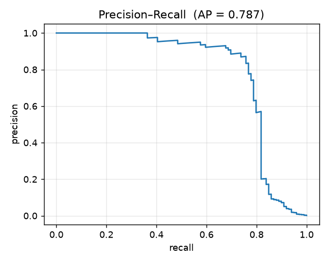
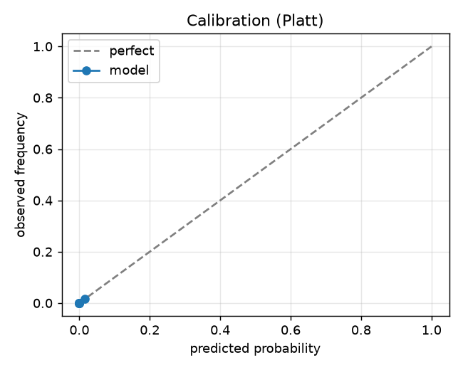
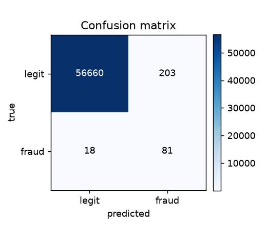

# Azure MLOps — Credit-Card Fraud Detection

A production-style MLOps project end to end: train an imbalanced fraud
classifier, calibrate it, choose the decision threshold from a cost model, serve
it behind an API, and monitor it for drift — all wired for **Azure** (Blob model
registry, Container Apps, Bicep, GitHub Actions, Application Insights).

## Why this isn't trivial

Fraud detection is hard because the classes are extremely imbalanced (~0.17%
fraud), so accuracy is meaningless. This project treats it properly:

- **Imbalance:** class-balanced gradient boosting (`HistGradientBoostingClassifier`).
- **Calibrated probabilities:** isotonic calibration on a held-out split, so a
  predicted 0.9 means something.
- **Cost-based threshold:** a missed fraud costs far more than a false alarm, so
  the threshold is chosen to minimise expected cost instead of defaulting to 0.5.
- **Evaluation that fits imbalance:** PR-AUC, recall at a precision target, and a
  calibration curve — not accuracy.
- **Drift monitoring:** PSI + KS per feature to catch when production data drifts
  from the training distribution.

## Architecture

```
   train.py                                   Azure Container Apps
  data ─► calibrate ─► cost threshold ─►  [ FastAPI  /score ] ─► client
              │                                  ▲     │
              ▼                                  │     └─► Application Insights
        Model registry  ──────────────────────────┘        (telemetry)
     (Azure Blob: model + metadata + `latest` pointer)
```

- **Registry:** versioned model + metadata on Azure Blob (local folder or Azurite for dev).
- **Compute:** containerized FastAPI on Azure Container Apps with HTTP autoscaling.
- **IaC:** Bicep provisions Storage, ACR, Log Analytics, App Insights, and the Container Apps environment + app.
- **CI/CD:** GitHub Actions — CI runs tests + a smoke train; CD builds the image in ACR and deploys the Bicep.

## Results

Dataset: OpenML credit-card fraud (the ULB benchmark) — 284,807 transactions,
0.17% fraud. Held-out test split.

| metric | value |
| --- | --- |
| PR-AUC | 0.787 |
| recall @ precision ≥ 0.90 | 0.70 |
| recall (at cost-based threshold) | 0.82 |
| precision (at cost-based threshold) | 0.28 |

The cost model (a false negative costs 50× a false positive) drives the decision
threshold low (~0.006) to catch most fraud; probabilities are Platt-calibrated.
At a stricter operating point the model still recalls **70% of fraud while
keeping 90% precision**.





## Layout

```
src/
  data.py        # load OpenML credit-card fraud (synthetic fallback)
  model.py       # cost-based threshold + Scorer
  train.py       # train -> calibrate -> threshold -> evaluate -> register
  evaluate.py    # PR-AUC / recall@precision / calibration / confusion figures
  registry.py    # versioned model registry over a storage backend
  storage.py     # LocalStorage + AzureBlobStorage (same interface)
  monitoring.py  # PSI/KS drift + App Insights wiring
  serve.py       # FastAPI scoring service
scripts/drift_report.py
infra/main.bicep            # Azure infrastructure as code
.github/workflows/          # ci.yml (test + smoke train), cd.yml (build + deploy)
tests/                      # storage, threshold, drift
```

## Run locally

```bash
pip install -r requirements.txt
PYTHONPATH=. python -m src.train               # train + register locally, write results/ + assets/
PYTHONPATH=. uvicorn src.serve:app --reload    # serve
curl -s localhost:8000/health
PYTHONPATH=. python -m scripts.drift_report    # data-drift report
pytest -q
```

### Verify the Azure path locally with Azurite

The model registry talks to Azure Blob through the official SDK; point it at
[Azurite](https://github.com/Azure/Azurite) (the storage emulator) to exercise
that path with no Azure account:

```bash
npx azurite --silent
export STORAGE_BACKEND=azure_blob
export AZURE_STORAGE_CONNECTION_STRING="UseDevelopmentStorage=true"
PYTHONPATH=. python -m src.train               # registers the model into Blob
```

## Deploy to Azure (your subscription)

```bash
az login
az group create -n fraud-mlops-rg -l westeurope
az acr create -g fraud-mlops-rg -n <acrName> --sku Basic --admin-enabled true
az acr build -r <acrName> -t fraud-api:v1 .
az deployment group create -g fraud-mlops-rg -f infra/main.bicep \
  -p containerImage=<acrName>.azurecr.io/fraud-api:v1
```

Or push to `main` and let the `cd` workflow build + deploy (set the
`AZURE_CLIENT_ID` / `AZURE_TENANT_ID` / `AZURE_SUBSCRIPTION_ID` / `ACR_NAME`
secrets for an OIDC service principal first).

## What's verified here vs your step

Verified locally in this repo: training and evaluation, calibration + the
cost-based threshold, the model registry against **Azurite** (the real Azure Blob
SDK), the FastAPI service, drift detection, the unit tests, and `bicep build` of
the infrastructure. The one step that needs an Azure subscription — creating the
live resources and running the container — is fully wired and documented here,
not executed.
